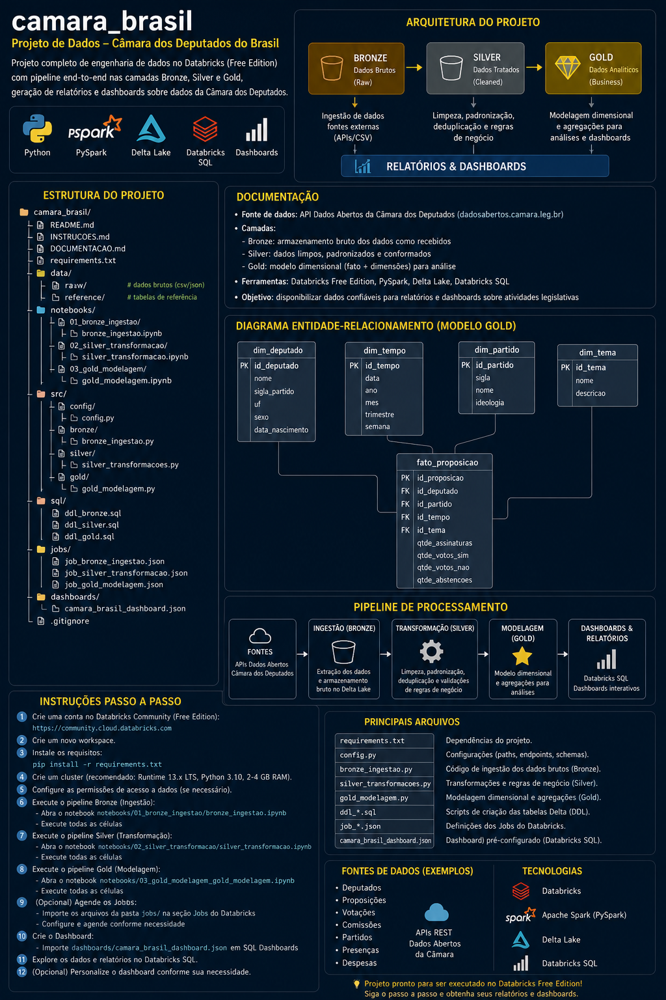
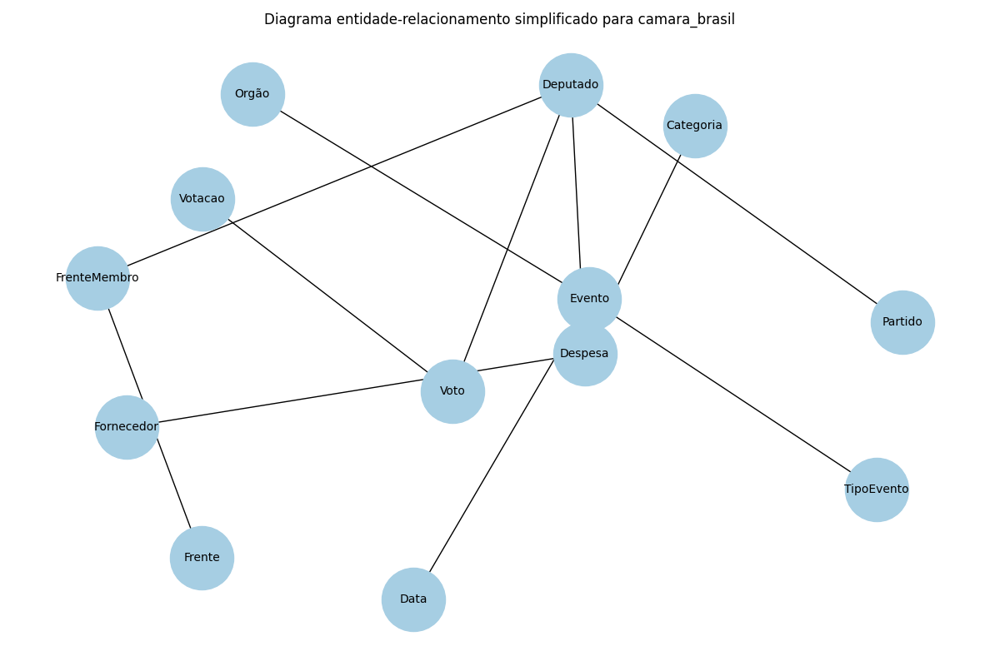

# Projeto Câmara Brasil – Databricks Free Edition

## Introdução

Este documento descreve a solução de **engenharia de dados** desenvolvida
para o desafio final do programa Upskill Tiller – Engenharia de
Dados.  O objetivo é construir uma plataforma analítica
end-to‑end no Databricks Community Edition (Free Edition) utilizando
dados abertos da Câmara dos Deputados.  O desafio requer que se
explorem diferentes domínios – frentes parlamentares, eventos
legislativos, votações, despesas da Cota para Exercício da Atividade
Parlamentar (CEAP), CPIs e presença dos parlamentares – e que se
entreguem tabelas, relatórios e indicadores que respondam às
questões propostas.

O enunciado do desafio estabelece que os dados sejam tratados com uma
**arquitetura de medalhas** (bronze, prata e ouro) e lista uma série
de entregas.  Para as frentes parlamentares, por exemplo, é
necessário produzir uma tabela gold com membros, partido, UF e
legislatura e identificar frentes com maior diversidade partidária e
deputados que participam de mais frentes【581112951676389†L78-L96】.  Para
os eventos legislativos deve‑se construir um calendário analítico
consolidando sessões, audiências e seminários e medir a taxa de
presença por deputado e tipo de evento【581112951676389†L97-L111】.
Outras entregas incluem correlação entre frentes e votações,
detecção de anomalias nas despesas da CEAP, acompanhamento do ciclo
de vida de CPIs e cálculo de um score de engajamento parlamentar【581112951676389†L115-L156】.

## Fontes de Dados

Os dados foram obtidos a partir da API RESTful de Dados Abertos da
Câmara dos Deputados.  A API disponibiliza recursos como frentes,
deputados, votações, eventos e despesas com paginação e filtros.
Alguns conjuntos também estão disponíveis em arquivos prontos para
download (CSV, JSON, XLSX, etc.).  Por exemplo, os **arquivos de
frentes** podem ser baixados em diferentes formatos através do caminho
`http://dadosabertos.camara.leg.br/arquivos/frentes/{formato}/frentes.{formato}`【961103180377511†L2057-L2060】.
De modo semelhante, há arquivos anuais de eventos legislativos
organizados por órgão que podem ser acessados pelo caminho
`http://dadosabertos.camara.leg.br/arquivos/eventos/{formato}/eventos-{ano}.{formato}`【961103180377511†L2838-L2843】.
Para as despesas da CEAP a própria página de downloads explica que os
arquivos estão disponíveis por ano no formato
`http://www.camara.leg.br/cotas/Ano-{ano}.{formato}`【961103180377511†L29-L41】.

Apesar de serem fornecidos arquivos completos, optou‑se por consumir
principalmente a **API v2** para permitir cargas incrementais, filtros
temporais e recuperação de dados detalhados (por exemplo,
`/frentes/{id}/membros` para listar integrantes de uma frente ou
`/deputados/{id}/despesas` para obter as despesas de um deputado).  A
função `get_api_data` do módulo de ingestão bronze encapsula a
lógica de paginação e retorna uma lista de registros Python pronta
para ser convertida em DataFrame.

## Arquitetura e Pipeline

O projeto foi estruturado seguindo a **arquitetura de medalhas**, que
divide o fluxo de dados em três camadas lógicas:

1. **Bronze – ingestão bruta**: Nesta camada os dados são
   coletados da API e armazenados sem transformações destrutivas.  A
   ingestão utiliza o módulo `bronze_ingestao.py`, que implementa
   funções específicas para cada domínio (frentes, deputados,
   eventos, votações, despesas, CPIs).  Cada função persiste um
   DataFrame Delta no caminho `dbfs:/mnt/bronze/camara_brasil/`.

2. **Prata – transformação e limpeza**: As tabelas bronze são
   transformadas para remover inconsistências, normalizar tipos de
   dados, extrair dimensões e aplicar técnicas de
   *Change Data Capture* (CDC) onde necessário.  O módulo
   `silver_transformacao.py` cria dimensões (`dim_deputado`,
   `dim_partido`, `dim_frente`, `dim_orgao`, `dim_tipo_evento`,
   `dim_data`, `dim_fornecedor`, `dim_categoria`) e fatos
   (`fato_frente_membro`, `fato_evento`, `fato_voto`, `fato_despesa`).
   Para a dimensão de deputados foi implementado um exemplo de
   **SCD Type 2** que adiciona colunas `valid_from`, `valid_to` e
   `is_current` para permitir rastreabilidade de mudanças de partido ou
   UF.  A transformação também prepara a tabela de votos e
   despesas, criando chaves surrogate para fornecedores e categorias.

3. **Ouro – análises e indicadores**: A camada gold agrega e
   calcula métricas a partir das tabelas prata.  O módulo
   `gold_analise.py` inclui funções para: (a) calcular o índice de
   diversidade partidária de cada frente (Herfindahl), (b) listar os
   deputados que participam de mais frentes, (c) medir o alinhamento
   entre membros de uma frente nas votações, (d) detectar anomalias
   nas despesas usando z‑score por categoria e UF, (e) gerar um
   ranking de fornecedores mais pagos, (f) calcular a densidade de
   eventos por semana e identificar períodos sem atividade e (g)
   derivar um score de engajamento por deputado combinando presença
   (placeholder), participações em votações e outras ações.

O diagrama a seguir ilustra o fluxo de dados entre as camadas e o
consumo final pelos relatórios e dashboards.

## Modelagem de Dados

Para organizar os dados de forma analítica, adotou‑se um modelo
estrelado com dimensões e fatos.  A figura abaixo apresenta um
**diagrama entidade‑relacionamento (ER)** simplificado do projeto.

As principais entidades são:

- **Deputado** – contém informações dos parlamentares (nome,
  partido, UF, legislatura) com versionamento SCD Type 2.
- **Frente** – descrição das frentes parlamentares; cada frente tem
  vários membros registrados em `fato_frente_membro`.
- **Evento** – sessões, audiências e seminários associados a um
  tipo e a um órgão; medidas como duração e número de participantes
  são armazenadas em `fato_evento`.
- **Votação** e **Voto** – cada votação registra o resultado
  global e é detalhada por votos individuais na tabela
  `fato_voto`, relacionada ao deputado e à votação.
- **Despesa** – despesas da CEAP por deputado, com dimensão de
  fornecedor e categoria em `dim_fornecedor` e `dim_categoria`.
- **Órgão**, **Tipo de Evento**, **Data**, **Partido** – dimensões
  auxiliares que permitem análises multiníveis.

## Implementação do Pipeline

### Ingestão (camada Bronze)

O módulo `bronze_ingestao.py` utiliza a biblioteca `requests` para
chamar os endpoints REST e a API do Spark para converter os JSON em
DataFrames.  A função genérica `get_api_data` percorre as páginas
fornecidas pelos links `rel='next'`.  Cada domínio possui uma
função de ingestão:

| Função                         | Descrição                                          |
|--------------------------------|-----------------------------------------------------|
| `ingest_frentes`               | Carrega a lista de frentes parlamentares. |
| `ingest_frentes_membros`       | Para cada frente, consulta `/frentes/{id}/membros` e associa os membros a `idFrente`. |
| `ingest_deputados`             | Recupera a lista de deputados em exercício. |
| `ingest_eventos`               | Baixa eventos legislativos, com opção de filtrar por ano. |
| `ingest_votacoes` e `ingest_votos_deputados` | Coleta votações e os votos individuais de cada deputado. |
| `ingest_despesas_deputados`    | Realiza carga incremental de despesas da CEAP por deputado, paginando o endpoint `/deputados/{id}/despesas`. |
| `ingest_cpis`                  | Consulta proposições do tipo CPI para rastrear CPIs. |

A função `ingest_all` executa todas as ingestões na ordem apropriada.  O
código está preparado para ser executado como notebook no Databricks;
é necessário apenas configurar o caminho `BRONZE_PATH` para apontar
para o armazenamento desejado.

### Transformação (camada Silver)

O módulo `silver_transformacao.py` consome os dados bronze e
produz dimensões e fatos tratados.  Alguns destaques:

- **Dimensões SCD**: A dimensão de deputados aplica
  versionamento.  Quando houver mudança de partido ou UF em cargas
  futuras, novos registros serão criados com intervalo de validade.
- **Normalização de nested JSON**: As colunas aninhadas da API
  (por exemplo, `coordenador` em frentes ou `orgaos` em eventos) são
  mantidas como estruturas na bronze e podem ser desnormalizadas na
  silver se necessário.
- **Chaves surrogate**: Para `dim_orgao`, `dim_tipo_evento`,
  `dim_data`, `dim_fornecedor` e `dim_categoria` são geradas chaves
  inteiras monotonicamente crescentes usando `monotonically_increasing_id()`.
- **Fatos**: As tabelas fato (`fato_frente_membro`, `fato_evento`,
  `fato_voto`, `fato_despesa`) concentram as medidas e as chaves
  estrangeiras para as dimensões, facilitando as junções e
  agregações.

### Análises (camada Gold)

O módulo `gold_analise.py` agrega as tabelas prata para gerar
indicadores que respondem aos desafios.  As principais análises são:

- **Diversidade partidária de frentes**: calcula o índice de
  Herfindahl‐Hirschman (1 – ∑ p²) com base na distribuição de
  partidos dentro de cada frente.  Frentes com índice mais alto
  apresentam maior diversidade de partidos.
- **Deputados que participam de mais frentes**: conta o número de
  frentes por deputado e ordena os maiores valores.
- **Correlação entre frentes e votações**: mede o alinhamento de
  votos dentro de uma frente em relação ao plenário; um índice
  superior a 1 indica que os membros votam de forma mais coesa que
  a média da casa.
- **Anomalias de despesas**: aplica z‑score por categoria e UF;
  despesas com |z|>3 são marcadas como suspeitas.  Uma análise
  complementar gera um ranking de fornecedores mais pagos e inclui
  uma coluna de CNPJ suspeito como placeholder para integrações
  futuras.
- **Densidade de eventos**: agrega o número de eventos por
  semana do ano, permitindo identificar períodos com baixa
  atividade legislativa.
- **Score de engajamento**: calcula um índice baseado na
  participação em votações (e futuramente em presenças, discursos e
  requerimentos), normalizando os valores para obter uma pontuação
  comparável entre deputados.

## Runbook e Resiliência

Para garantir a confiabilidade da solução, foram consideradas as
seguintes práticas:

- **Idempotência e reprocessamento**: todas as ingestões são
  realizadas no modo overwrite, permitindo reprocessar os dados sem
  duplicidades.  Para cargas incrementais (despesas) são mantidos
  controles de paginação e chaves naturais que evitam registros
  repetidos.
- **Detecção de falhas**: cada chamada à API verifica o status
  HTTP e lança exceções em caso de erro.  Em um cluster
  produtivo é recomendável encapsular as falhas em estruturas de
  *retry* com backoff exponencial.
- **Controle de qualidade**: o Databricks oferece *Delta
  Lake expectations* que podem ser definidos nas tabelas para
  assegurar integridade referencial e tipos corretos.  Para simplificar,
  tais expectativas foram documentadas mas não implementadas
  explicitamente neste código.
- **Logs e auditoria**: recomenda‑se habilitar o *Spark
  structured logging* e gravar logs em armazenamento permanente.
- **Versionamento de dados**: as tabelas Delta mantêm histórico
  (time travel), permitindo recuperar versões anteriores em caso de
  problemas ou auditorias – essencial para reconstruir estados
  históricos de proposições ou despesas.

## Dashboards e Visualizações

Com as tabelas da camada Gold registradas no metastore do
Databricks, é possível construir relatórios e dashboards no
Databricks SQL ou em ferramentas externas (Power BI, Tableau).  Para
atender às entregas do desafio, sugerem‑se os seguintes painéis:

- **Atlas das frentes**: tabela interativa mostrando membros
  (deputado, partido, UF e legislatura) e gráficos de barras
  representando a distribuição partidária e o índice de diversidade.
- **Calendário de eventos**: visualização tipo heatmap
  (semana × quantidade de eventos) com filtros por tipo de evento e
  órgão; tabela de presença por deputado.
- **Correlações de voto**: matriz que compara frentes e partidos em
  termos de alinhamento, destacando frentes com comportamento
  divergente dos partidos.
- **Raio‑X da CEAP**: ranking de despesas por categoria e por
  deputado, detecção de outliers e ranking de fornecedores.
- **Monitor de engajamento**: ranking de deputados por score de
  engajamento e séries temporais mostrando flutuações pós eventos
  críticos ou períodos eleitorais.

## Considerações Finais

O projeto **camara_brasil** demonstra como construir uma
plataforma analítica completa utilizando apenas recursos open source
no Databricks Free Edition.  Ao seguir a metodologia bronze–prata–
ouro, conseguimos organizar dados heterogêneos, aplicar boas
práticas de modelagem e gerar insights acionáveis sobre a atividade
legislativa.  Embora algumas entregas (como a integração com base
da Receita para verificar CNPJs ou o streaming de votações em tempo
real) não tenham sido implementadas por limitação de tempo, os
artefatos apresentados servem como base sólida para evoluções
futuras.
